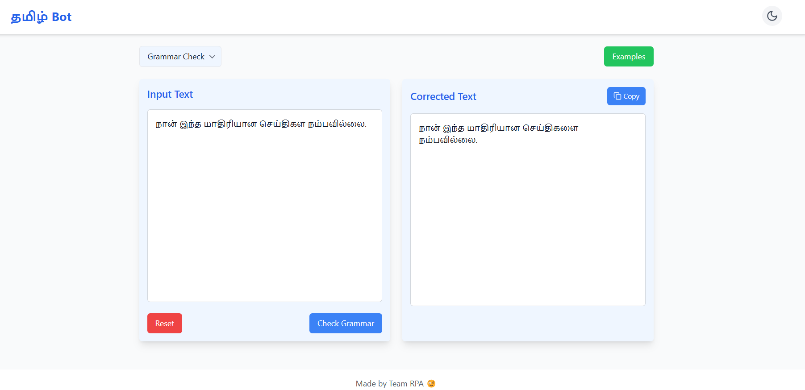

# Tamil Grammar Correction Bot

## Overview

This project is a Tamil text processing application that provides two main functionalities:
- **Grammar Checking**: Corrects grammatical errors in Tamil text.
- **Summarization**: Summarizes Tamil text with adjustable summary lengths (Short, Medium, Long).

The application is built using React and Tailwind CSS, with a focus on a clean and responsive user interface. It supports both light and dark modes. Powered by Google's Custom Trained Gemini API's.

## Features

- **Input Text Area**: Enter or paste Tamil text for processing.
- **Summary Length Slider**: Adjust the length of the summary (Short, Medium, Long).
- **Grammar Correction**: Automatically corrects grammar while preserving the original meaning.
- **Summary Generation**: Provides summaries based on the selected length percentage.
- **Copy Button**: Copy the output text to clipboard.
- **Examples Button**: Load example texts for quick testing.

## Screenshots


*Dark Mode View*


*Light Mode View*

## Installation

1. **Clone the Repository**

   ```bash
   git clone https://github.com/Reuben-Stephen-John/Tamil-Grammar-Bot
   ```

2. **Navigate to the Project Directory**

   ```bash
   cd Tamil-Grammar-Bot
   ```

3. **Install Dependencies**

   Ensure you have [Node.js](https://nodejs.org/) installed. Then run:

   ```bash
   npm install
   ```

4. **Start the Development Server**

   ```bash
   npm start
   ```

   The application will be available at [http://localhost:3000](http://localhost:3000).

## Usage

1. **Select Mode**: Choose between "Grammar Check" and "Summarize" from the dropdown menu.
2. **Input Text**: Enter or paste your Tamil text into the input area.
3. **Adjust Summary Length**: Use the slider to select the desired summary length (20% for Short, 50% for Medium, 70% for Long).
4. **Process Text**: Click the appropriate button to either summarize or check grammar.
5. **Copy Output**: Use the "Copy" button to copy the result to your clipboard.

## Configuration

- **API Integration**: Configure your Gemini API keys in the `.env` file.

## Contributing

Contributions are welcome! Please submit a pull request or open an issue for any bugs or feature requests.
